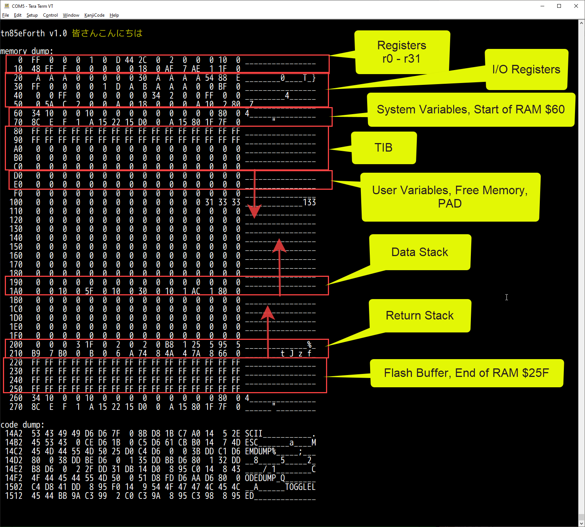

# tn85eForth
eForth for attiny85. USI module as UART.

# 0. Before you start
@rem write the fuses - 8 MHz - use this!
avrdude.exe -p attiny85  -c usbtiny -U lfuse:w:0xE2:m
@rem write the fuses - enable SPM instruction
avrdude.exe -p attiny85  -c usbtiny -U efuse:w:0xFE:m

# 1. Memory Map

